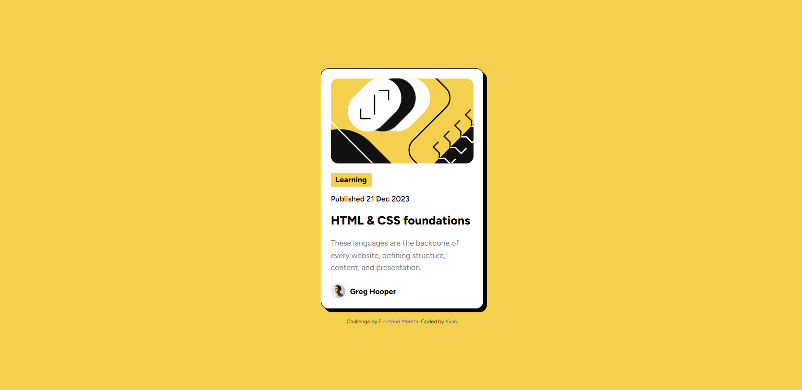

# Frontend Mentor - Blog preview card solution

This is a solution to the [Blog preview card challenge on Frontend Mentor](https://www.frontendmentor.io/challenges/blog-preview-card-ckPaj01IcS). Frontend Mentor challenges help you improve your coding skills by building realistic projects. 

## Table of contents

- [Overview](#overview)
  - [The challenge](#the-challenge)
  - [Screenshot](#screenshot)
  - [Links](#links)
- [My process](#my-process)
  - [Built with](#built-with)
  - [What I learned](#what-i-learned)
  - [Continued development](#continued-development)
- [Author](#author)

## Overview

### The challenge

Users should be able to:

- See hover and focus states for all interactive elements on the page

### Screenshot

### Links

- Solution URL: [Solution](https://www.frontendmentor.io/solutions/responsive-solution-using-scss-flexbox-grid-_vpqzuemcn)
- Live Site URL: [Live Site](https://kaantkin.github.io/Blog-Preview-Card-FM/)

## My process

### Built with

- Semantic HTML5 markup
- SCSS
- Flexbox
- CSS Grid
- Responsive layout

### What I learned

During development I improved my use of semantic HTML and accessability. I also implemented grid layout to set the layout of the side and flexbox to align items. I also learnt about scss and how to implement it, alongside some practices. I further improved on response-first structure, attempting to maximise responsibility on all elements.

### Continued development

I will continue to develop on scss and further my knowledge and use of semantic HTML and accessability.

## Author

- Website - [My site](https://kaantkin.github.io)
- Frontend Mentor - [@kaantkin](https://www.frontendmentor.io/profile/kaantkin)